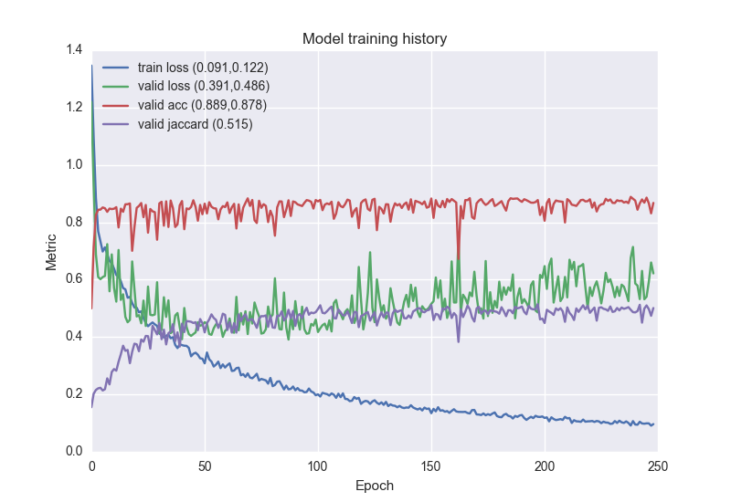
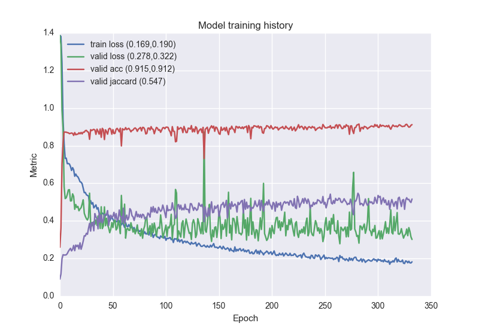
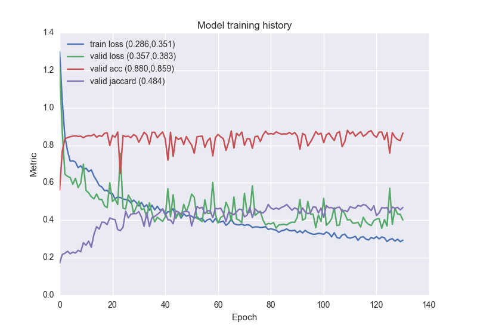

# Deep learning for polyp characterization

## Results Keras
| Id | Model | Parameters                         | Train set        | Val set          | Test set                       |Tr. Loss|Val. Loss|Val. Acc|Val. Jacc|Test Acc|Test Jacc|Epochs | Jaccard per class (Bckg, pol, Spec, Lum)|
| --- | --- | --- | --- | --- | --- | --- | --- | --- | --- | --- | --- | --- | --- |
| 0 | Jorge |                                     |                  |                  | CVC-912 (Ts)                    |        |         | 81.87% | 44.77%  | 75.58% | 41.19%  |       | [ 0.73937106  0.22136171  0.44868447  0.23820789] |
| 1 | FCN8 | Deconv, lr=1e-4, l2=0, No Data Augm, Crop    | CVC-912 (Tr)          | CVC-912 (Val)          | CVC-912 (Ts)       | 0.122  | 0.486    | 87.80% | 51.50%  | 89.90% | 48.35%  | 249  | [0.89426552,  0.38210112,  0.30895791,  0.34876279] |
| 2 | FCN8 | Deconv, lr=1e-4, l2=0, Data Augm (Flip, Rot(180), Zoom(0.1), Crop)  | CVC-912 (Tr)          | CVC-912 (Val)          | CVC-912 (Ts) | 0.190  | 0.322    | 91.20% | 54.70%  | 82.43% | 42.03%  | 333  | [0.81224501,  0.27955095,  0.26045998,  0.32914331] |
| 2 | FCN8 | Deconv, lr=1e-4, l2=1e-3, Data Augm (Flip, Rot(180), Zoom(0.1), Crop)  | CVC-912 (Tr)        | CVC-912 (Val)          | CVC-912 (Ts) | 0.456  | 0.383    | 86.19% | 47.94%  | 86.38% | 40.56%  | 230  | [0.85935511,  0.277499305, 0.25355784, 0.232259597 ] |
| 3 | FCN8 | Deconv, lr=1e-4, l2=0, Data Augm (Flip, Rot(180), Zoom(0.1), Elast0.1 Bil, Crop)     | CVC-912 (Tr)          | CVC-912 (Val)          | CVC-912 (Ts) | 0.351  | 0.383    | 85.90% | 48.40%  | 87.29% | 42.79%  | 130  | [0.86779401,  0.32364056,  0.28232848,  0.23794606] |
| 4 | FCN8 | Deconv, lr=1e-4, l2=0, Data Augm (Flip, Rot(180), Zoom(0.1), Elast0.1 NN, Crop)  | CVC-912 (Tr)          | CVC-912 (Val)          | CVC-912 (Ts) | 0.229  | 0.341    | 88.74% | 51.10%  | 89.82% | 48.33%  | 256  | [0.89206086,  0.47399949,  0.24423865,  0.32314031] |
| 5 | FCN8 | Deconv, lr=1e-4, l2=0, Data Augm (Flip, Rot(180), Zoom(0.1), Shear0.5, Crop)  | CVC-912 (Tr)      | CVC-912 (Val)          | CVC-912 (Ts) | 0.152  | 0.204    | 94.00% | 62.39%  | 89.69% | 55.13%  | ???  | [0.88818576,  0.51609229,  0.38878289,  0.41218452] |
| 6 | resunet | lr=1e-4, l2=1e-4, Data Augm (Flip, Rot(180), Zoom(0.1), Crop??)  | CVC-912 (Tr)      | CVC-912 (Val)          | CVC-912 (Ts) | 0.276  | 0.277    | 91.24% | 52.87%  | 85.32% | 48.41%  | 243  | [0.8424,  0.2683,  0.4269,  0.3988] |
| 7 | fcn8 | lr=1e-4, l2=0, Data Augm (Elast, Shear(.41), Rot(180), Warp(10, 3), Crop)  | CVC-912 (Tr)      | CVC-912 (Val)          | CVC-912 (Ts) | 0.199  |  0.204   | 93.18% | 59.75% |  87.52% |50.15 %| 140  | [0.866525760217, 0.416273424807, 0.365415822596, 0.357791154721] |
| 8 | fcn8 | lr=1e-4, l2=0, Data Augm (Elast 0.1 NN_NN, Crop)  | CVC-912 (Tr)      | CVC-912 (Val)          | CVC-912 (Ts) | 0.236  |  0.428   | 87.99% | 49.46% |  88.51% |43.59 %| 135  | [0.880836956436, 0.277972459212, 0.280322247846, 0.30453909272] |
| 9 | fcn8 | lr=1e-4, l2=0, Data Augm (Flip, Rot(180), Crop)  | CVC-912 (Tr)      | CVC-912 (Val)          | CVC-912 (Ts) | 0.267  |  0.340   | 87.42% | 50.68% |  87.66% |44.44 %| 226  | [0.87059292,  0.36487132,  0.26324498,  0.27922294] |
| 10 | fcn8 | lr=1e-4, l2=0, Data Augm (Zoom(0.1), Crop)  | CVC-912 (Tr)      | CVC-912 (Val)          | CVC-912 (Ts) | 0.098  |  0.371   | 90.72% | 57.72% |  90.40% |50.41 %| 234  | [0.89959234,  0.40648192,  0.33234649,  0.37825429] |
| 11 | fcn8 | lr=1e-4, l2=0, Data Augm (Shear(0.5), Crop)  | CVC-912 (Tr)      | CVC-912 (Val)          | CVC-912 (Ts) | 0.112  |  0.333   | 90.48% | 56.83% |  90.28% |51.70 %| 251  | [0.897379764481, 0.463613590256, 0.338904191903, 0.368358490143] |

**Observations:** 
- The best mean jaccard does not seem to be the best in terms of polyp detection. Validation loss seems to be a better proxy, however, early stopping on the polyp-class jaccard would most likely be the most beneficial option. Or we could early stop different models on different per class metrics and do model averaging at test time.

### Experiment 1 (Deconv, lr=1e-4, l2=0, No Data Augm )

### Experiment 2 (Deconv, lr=1e-4, l2=0, Data Augm (No Elast) )

### Experiment 3 (Deconv, lr=1e-4, l2=0, Data Augm (Elast) )

## Results Lasagne
| Id | Model | Parameters                         | Train set        | Val set          | Test set                       |Tr. Loss|Val. Loss|Val. Acc|Val. Jacc|Test Acc|Test Jacc|Epochs |
| --- | --- | --- | --- | --- | --- | --- | --- | --- | --- | --- | --- | --- |
| 1 | FCN8 | Rep+Conv, lr=1e-4, l2=1e-3           | CVC-612          | CVC-300          | CVC-300                         | 0.52   | 0.41    | 86.99% | 54.89%  | 86.99% | 54.89%  | 139|
| 2 | FCN8 | Rep+Conv, lr=1e-4, l2=1e-3, He(Relu) | CVC-612          | CVC-300          | CVC-300                         | 0.42   | 0.45    | 86.93% | 53.95%  | 86.93% | 53.95%  | 183|
| 3 |FCN8 | Deconv_init, lr=1e-3, l2=1e-5         | CVC-612          | CVC-300          | CVC-300                         | 0.16   | 0.66    | 81.37% | 52.50%  | 81.37% | 52.50%  | 157|
| 4 | FCN8 | Rep+Conv, lr=1e-4, l2=1e-3, He(Relu) | CVC-612 (20 seq) | CVC-612  (5 seq) | CVC-612  (5 seq)                | 0.48   | 0.38    | 89.03% | 62.25%  | 89.61% | 63.04%  | 222|
| 5 | FCN8 | Deconv_init, lr=1e-4, l2=1e-5, He(Relu), voids | CVC-612 (20 seq) | CVC-612  (5 seq) | CVC-612  (5 seq)      | 0.64   | 0.66    | 85.27% | 54.84%  | 85.19% | 52.58%  | 212|
| 6 | U-Net | ???                                 | CVC-612          | CVC-612          | CVC-612                         | 0.65   | 94.37%  | 	0.66% | ??.??%  | ??.??% | ??.??%  | ?? |

## Posible problems to solve
 1. Polyp/No polyp image classification
 2. Polyp/Lumen/Specularity detection 
 3. Image semantic segmentation for the classes: Polyp/Lumen/Specularity/Void/Background
 4. Instance segmentation (Tracking of Polyps/Lumen/Specularities)
 5. Video Segmentacion
 6. Domain Adaptation
 7. Polyp classification (There are several types of polyps)
 
## Experiment configurations
 1. Intra pacient evaluation
 2. Inter pacient evaluation
 3. Inter camera evaluation
 4. Inter polyp evaluation
 
## First paper contributions
 1. Generate a public dataset that allows to perform different experiments
 2. Test a set of baselines for this dataset
  1, Jorge's published methods
  2. Deep learning methods: FCN8 & UNET
 
## Dataset
 1. Two datasets with: 300 and 612 color and fully annotated frames
 2. CVC-300 dataset is acquired at Irland and CVC-612 at Spain. The cameras are different.
 2. Image semantic annotation for each frame with the classes: Void(0)/Background(1)/Polyp(2)/Specularity(3)/Lumen(4)
 3. For each frame this extra metadata:
   1. Frame ID (In the dataset)
   2. Frame ID (In the original video) This data still is not available
   3. Patiend ID
   4. Polyp ID

## Framework
Keras

## Members
 1. Jorge Bernal
 2. Adriana Romero
 3. Michal Drozdzal
 4. David Vázquez
 5. People from Clinic? Jorge's Supervisor?
 7. Yoshua Bengio? Aaron Courville? Adriana's students?

## TODO
 - [X] Get Jorge's dataset with labels
 - [X] Adapt the dataset to work with FCN8 in lasagne
 - [X] First experiments with FCN8 in Lasagne
 - [X] Init weights with Glorot for Relu or He 
 - [X] Take voids into account
 - [X] Check for bugs in the plots code 
 - [X] Solve issues with the CSV of CVC-612
 - [X] Define a good split of the data for training/validation/test using the CSV files with the frames metadata
 - [X] Weight the class contributions to be able of learning specularities (Very small)  
 - [X] Jorge: Get baselines results on CVC-300 and CVC-612 
 - [X] Experiments with FCN8 in Lasagne to get reasonable results 
 - [X] Experiments data augmentation
 - [X] Upload FCN8 code for Keras
   - [X] Adapt the dataset to work in Keras
   - [X] Voids
   - [X] Multi-size in dataset loader
   - [X] Show images
   - [X] Jaccard index
   - [X] Add layers visualization
   - [X] Plot results
   - [X] Regularization
   - [X] Test data augmentation   
     - [X] Elastic nearest neighbour
     - [X] Image shear
     - [ ] Image bilinear and mask Nearest
     - [ ] Class weight balancing
   - [ ] Test different deconvolutions 
     - [ ] Deconv init
     - [ ] Unpool
     - [ ] Repetition + Convolution
   - [ ] Normalize images using mean and std
   - [ ] Ensembles
   - [ ] DICE index
   - [ ] Add gradient reversal to make the network agnostic to the patients (http://www.jmlr.org/proceedings/papers/v37/ganin15.pdf)
   - [ ] Move Unet model to Keras
 - [ ] Jorge: Change lumen annotations
 - [ ] Jorge: Get more images (If posible)
 
 - [ ] Different learning rates for bias than for weights
 - [ ] Batch normalization
 - [ ] First experiments with Unet
 - [ ] Define experiments
 - [ ] Select journal target (Michail has a proposal of a top medical imaging journal that answer in 1 month)
 - [ ] Add Frame ID (In the original video) to the datasets csv
 - [ ] Perform experiments
 - [ ] Write paper

## References jorge
 - [Impact of Image Preprocessing Methods on Polyp Localization in Colonoscopy Frames. Jorge Bernal et al.] (https://www.researchgate.net/profile/Jorge_Bernal5/publication/257602625_Impact_of_image_preprocessing_methods_on_polyp_localization_in_colonoscopy_frames/links/558924a208aed6bff80b3aa6.pdf) 
 - [WM-DOVA Maps for Accurate Polyp Highlighting in Colonoscopy: Validation vs. Saliency Maps from Physicians. Jorge Bernal et al.](http://158.109.8.37/files/BSF2015.pdf)
 - [Polyp Segmentation Method in Colonoscopy Videos by means of MSA-DOVA Energy Maps Calculation. Jorge Bernal et al.](http://158.109.8.37/files/BNS2014.pdf)

## References deep learning
 - [Fully Convolutional Networks for Semantic Segmentation. Jonathan Long et al.](https://arxiv.org/pdf/1411.4038.pdf)
 - [U-Net: Convolutional Networks for Biomedical Image Segmentation. Olaf Ronneberger et al.](https://arxiv.org/pdf/1505.04597.pdf)
